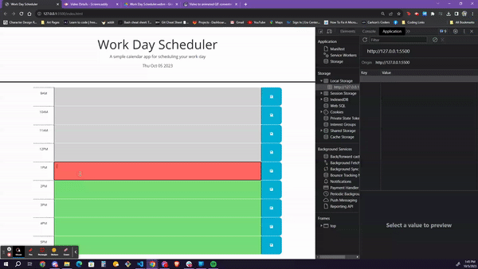

# 05 Third-Party APIs: Work Day Scheduler

## Your Task

Our task is to modify starter code which allows a user to save events for each hour of a regular work day from 9AM to 5 PM. This is to be run in teh browser and features dynamically updated HTML and CSS run by jQuery.

We were to use the [Day.js](https://day.js.org/en/) library to work with the date.

## User Story

```md
AS AN employee with a busy schedule
I WANT to add important events to a daily planner
SO THAT I can manage my time effectively
```

## Acceptance Criteria

```md
GIVEN I am using a daily planner to create a schedule
WHEN I open the planner
THEN the current day is displayed at the top of the calendar
WHEN I scroll down
THEN I am presented with timeblocks for standard business hours of 9am&ndash;5pm
WHEN I view the timeblocks for that day
THEN each timeblock is color coded to indicate whether it is in the past, present, or future
WHEN I click into a timeblock
THEN I can enter an event
WHEN I click the save button for that timeblock
THEN the text for that event is saved in local storage
WHEN I refresh the page
THEN the saved events persist
```
## Gif Links

The following animation demonstrates the application functionality:




## Project Link to GitHub

[Github - Day JS Scheduler:](https://github.com/charmingdarling/dayjsplanner)

[Github - Deployed Site:](https://charmingdarling.github.io/dayjsplanner/)